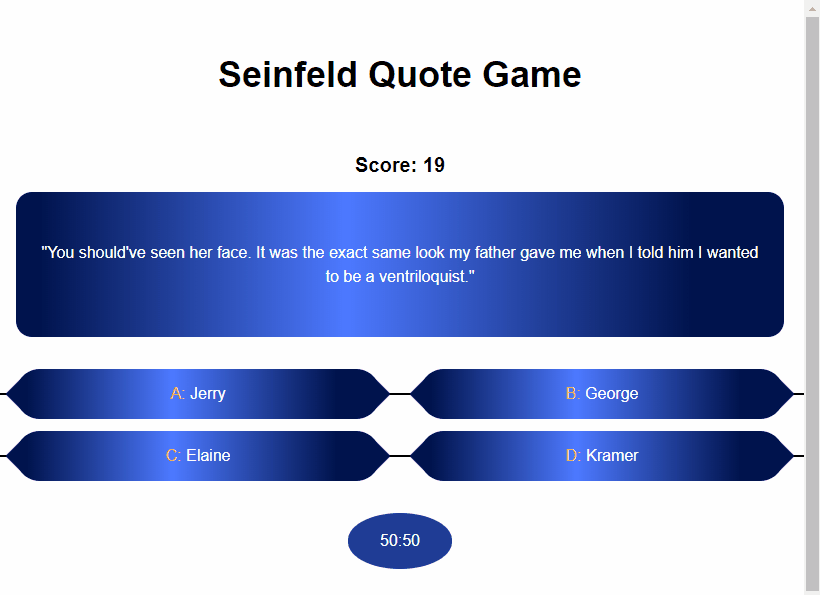

# SeinfeldQuizShow
Seinfeld Quote Game is a trivia game that tests your knowledge of Seinfeld quotes. If you can correctly identify the author of the quote, you are awarded a point and proceed to the next question. If you guess wrong, you are taken to high score screen where you can enter your initials.

## Table of contents
* [Demo](#Demo)
* [General info](#general-info)
* [Technologies](#technologies)
* [Features](#features)
* [Setup](#setup)
* [Acknowledgements](#acknowledgements)

## Demo
[Interact with demo](https://y2j964.github.io/SeinfeldTriviaGame/).

## General Info
This exercise was mostly an excuse to get some experience making AJAX calls to a public API. Being the Seinfeld fanatic that I am, I quickly discovered the Seinfeld Quotes API and decided to make a trivia game out of it. I wanted to do something eye-catching with the UI, so I did an homage to my favorite game show as a child, Who Wants to Be a Millionaire.

## Technologies
* Webpack 4.32.2
* ES6 modules
* AJAX
* Promises
* PubSub
* Tailwind CSS 1.0.4
* Sass
* Git and Git Bash

## Features
* High Score Table set up with localStorage
* Table-row animation after user inputs initials
* Who Wants to Be a Millionaire right/wrong answer animation
* 50/50 button that the user can use to eliminate 2 wrong answers
* Local storage of high scores to ensure that previous high scores are securely recorded
* Aria-supported

## Setup
This project uses Webpack for bundling and minification and uses TailwindCSS for a CSS framework. Sass is additionally used to build css components.

### Dependencies
To get started, clone this repo  and run `npm install`.

### Production
Here are the production scripts:

#### `npm run start`
Sets up a watcher for CSS (including TailwindCSS) and JS, and outputs changes accordingly.

### Build
Here are the build scripts:

#### `npm run build`
Builds all JS and CSS (including TailwindCSS files).

## Acknowledgements
  * AJAX calls are made to the [Seinfeld Quotes API](https://seinfeld-quotes.herokuapp.com/).
  * The question and answer UI is based on the [UI of Who Wants to Be a Millionaire](https://hips.hearstapps.com/digitalspyuk.cdnds.net/18/19/1526074052-screen-shot-2018-05-11-at-222113.png?resize=480:*).
  * The favicon was used from [Seinfeld Fandom Wiki](https://seinfeld.fandom.com/wiki/Seinfeld).
  * [Pubsub-js 1.7.0](https://www.npmjs.com/package/pubsub-js/v/1.7.0) was used to keep modules decoupled.
  * [Google Fonts](https://fonts.google.com/) was used for additional fonts.
